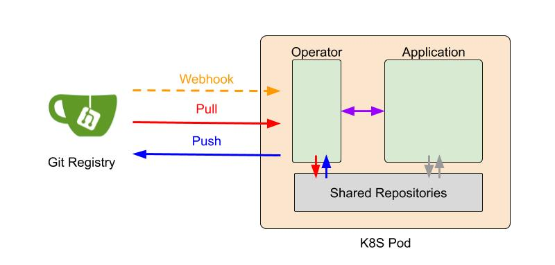

# Harmonia 
Harmonia is an opensource project aiming at developing systems/infrastructures and libraries to ease the adoption of [federated learning](https://en.wikipedia.org/wiki/Federated_learning) (abbreviated to FL) for researches and production usage. It is named Harmonia, the Greek goddess of harmony, to reflect the spirit of federated learning; that is, multiple parities collaboratively build a ML model for the common good. 

The first release includes Harmonia-operator SDK and differential privacy modules (https://github.com/ailabstw/blurnn). We welcome contributions of new aggregation algorithms, privacy mechanism, datasets, etc. Let's work together to flourish the growth of federated learning. 

# FL System Architecture

</img>
  

The design of the Harmonia system is inspired by [GitOps](https://www.weave.works/blog/gitops-operations-by-pull-request). GitOps is centerred around a git repository, which maintains the desired states in the production environment. An automated process makes the production environment match the described state in the repository. In Harmonia, a FL training strategy, global models, and local models/gradients are kept in the git repositories. Updates to these git respoitroies trigger FL system state transitions. This automates the FL training process. A participant in a federated training is activated as a K8S Pod, which is composed of an `Operator` container and an `Application` container. An `Operator` container is in charge of maintaining the FL system states, and communicates with an `Application` container via gRPC. Local training and aggerator applications are encapsulated in `Application` containers. This design enables easy deployment in a Kubernetes cluster environment, and quick plug-in of existing ML workflows.

# Documentation
* [docs](docs/)
    * [docs/get-started](docs/get-started): A step-by-step [example](examples/mnist) tutorial
    * [docs/sdk](docs/sdk/): Detailed sdk document

# Build
To build Harmonia operator, `make all` for `harmonia/operator` image

# Supported Platform
Kubernetes

# Example
See `examples/mnist`

# Get Started
See [docs/get-started](docs/get-started)
