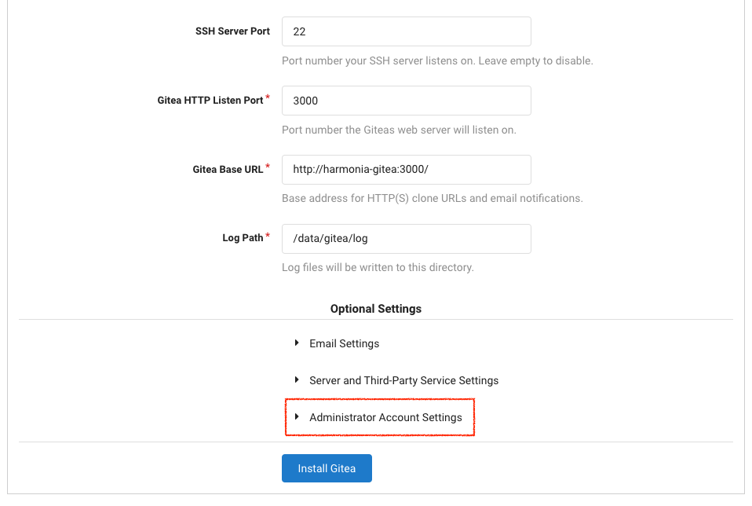

# Setup

Before running Harmonia FL projects, a Gitea service should be started up as a centralized git registry. Following shows how to start up Gitea in k8s. See [Gitea document](https://docs.gitea.io/en-us/install-with-docker/) for detail.

1. Deploy Gitea
    ```yml
    # gitea_deployment.yml
    apiVersion: v1
    kind: ConfigMap
    metadata:
      name: gitea-config
    data:
      ROOT_URL: http://harmonia-gitea:3000
      LFS_START_SERVER: "true"
    ---
    apiVersion: apps/v1
    kind: Deployment
    metadata:
      name: gitea-deployment
      labels:
        app: gitea
    spec:
      replicas: 1
      selector:
        matchLabels:
          app: gitea
      template:
        metadata:
          labels:
            app: gitea
        spec:
          containers:
            - name: gitea
              image: gitea/gitea
              ports:
                - containerPort: 3000
                  name: gitea
              envFrom:
                - configMapRef:
                    name: gitea-config
    ---
    kind: Service
    apiVersion: v1
    metadata:
      name: harmonia-gitea
    spec:
      selector:
        app: gitea
      ports:
      - name: gitea-http
        port: 3000
        targetPort: 3000
      type: NodePort
    ```

2. k8s apply
    ```bash
    kubectl apply -f gitea_deployment.yml
    ```

3. Install Gitea
    1. Set port-forwarding  
        ```bash
        kubectl port-forward --address 0.0.0.0 service/harmonia-gitea 3000
        ```
    2. Install Gitea  (`http://127.0.0.1:3000/install`)  
    