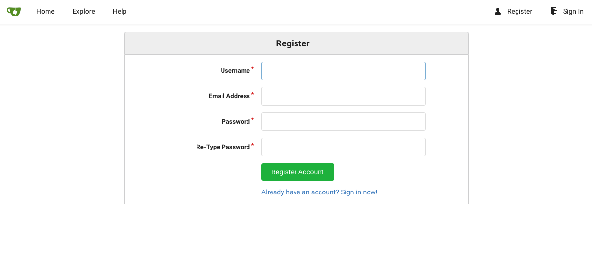
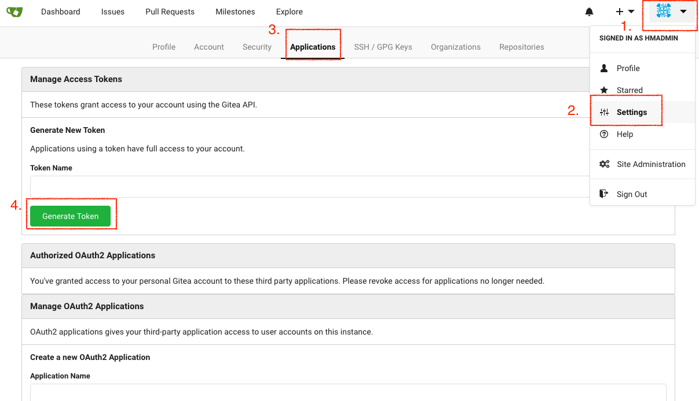
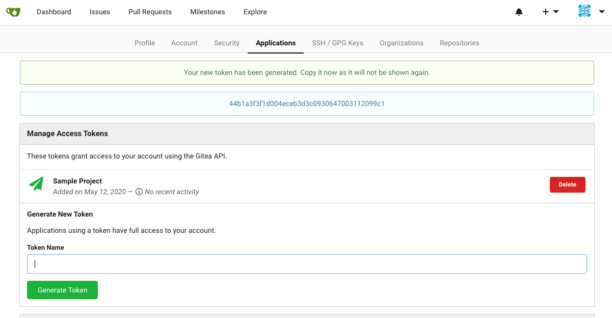
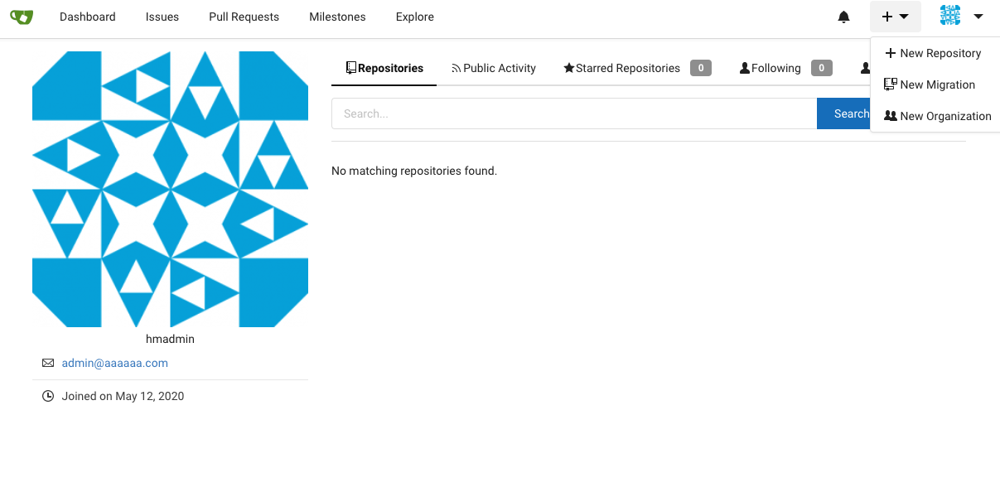
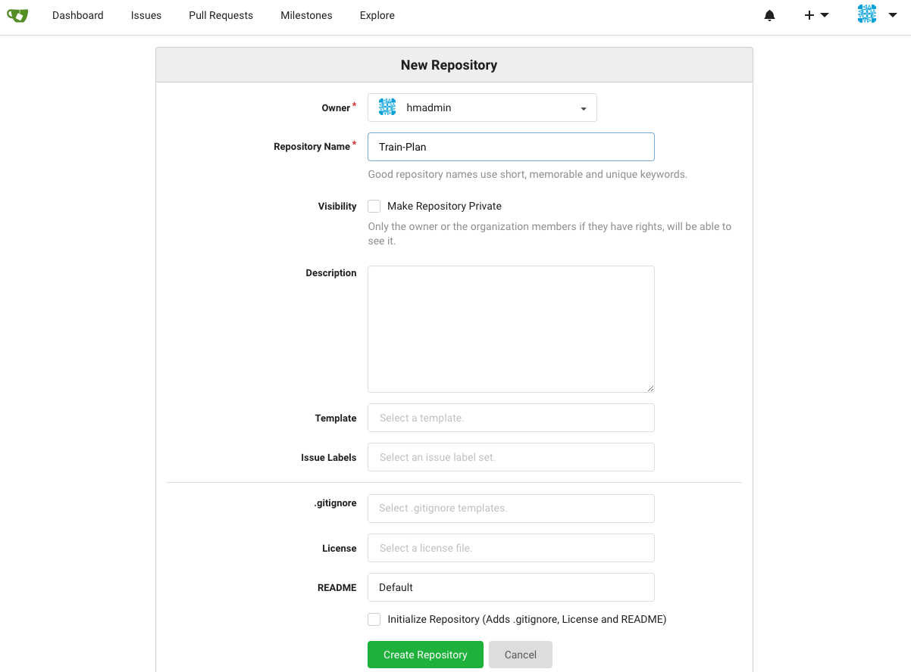
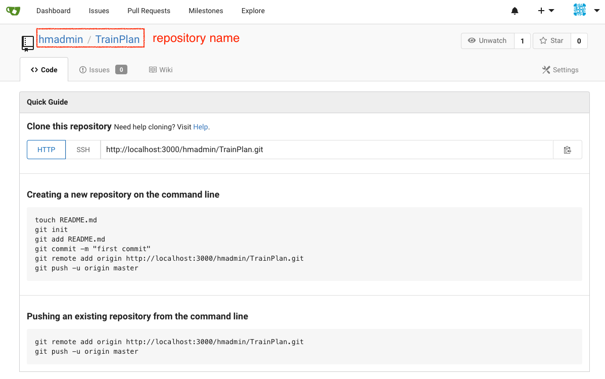
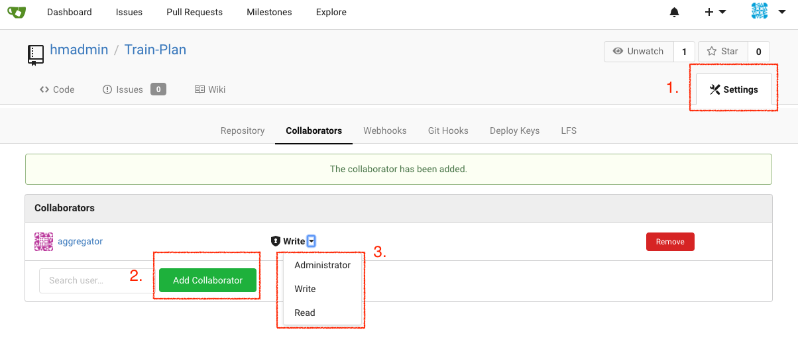
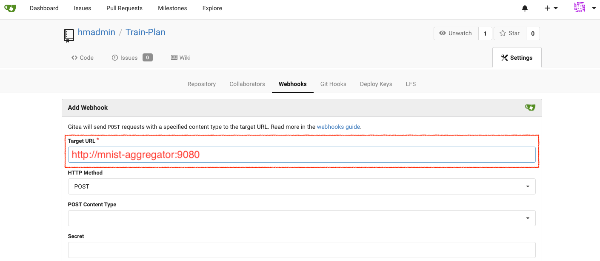

# FL Project Setup

This chapter shows how to setup a 2-edge FL Harmonia environment. There are 3 accounts and repositoreis for each participant(`aggregator`, `edge1`, `edge2`) and another repository `train-plan` to be created. Relations between entities would be created in this chapter. All these operations are demonstrated by Gitea GUI. For automation demand, all operations are covered in [Gitea APIs](https://docs.gitea.io/en-us/api-usage/) and [try it](https://try.gitea.io/api/swagger).

1. Create or register Gitea accounts representing each participants of FL, `aggregator`, `edge1`, `edge2`

2. For security, we strongly recommend to use application token instead of user password in operator configurations mentioned in [chapter 4](./ch4-execute-learning.md). To generate tokens:

3. Create repositories `train-plan`, `global-model`, `local-model1`, `local-model2`.

4. Setup permissions of each repositories.
    |Repository |`aggregator`   |`edge1`    |`edge2`|
    |---                |---    |---        |---    |
    |train-plan         |Read   |Read       |Read   |
    |global-model       |Write  |Read       |Read   |
    |local-model1       |Read   |Write      |None   |
    |local-model2       |Read   |None       |Write  |

5. Setup webhooks of each repositories. In k8s, value of `Target URL` could be the service name of a pod or deployment, i.e. `metadata.name` field in `Service` object. This would be set in [chapter 3](./ch3-k8s-deployment.md).  
For instance, changes of `local-model1` should be aware or listened by `aggregator` pod, so a `local-model1` webhook should be created in order to notify aggregator what the repository updates. The target URL should be filled with `http://mnist-aggregator:9080`.

Here is the webhook setup list:
|Repository         |Webhooks(Target URL)   |
|---                |---                    |
|global-model       |`http://mnist-edge1:9080` `http://mnist-edge2:9080`|
|local-model1       |`http://mnist-aggregator:9080`|
|local-model2       |`http://mnist-aggregator:9080`|
|train-plan         |`http://mnist-aggregator:9080` `http://mnist-edge1:9080` `http://mnist-edge2:9080`|
