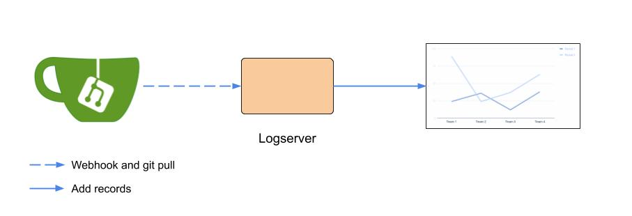

# Logserver
<div align="center"></div>

Harmonia logserver collects the metrics from the `local-model` and `global-model` repositories and adds records into tensorboard.

## Build
```bash
pushd src/logserver
make
popd
```

## Configuration
`harmonia/logserver` can be configured with `/app/config.yml`. Each field in the configuration file is described below:
```yaml
gitUserToken: <logserver_token>
modelRepos:
  - gitHttpURL: http://<logserver_account>@<gitea_URL>/<model_repo>.git

```

|Field      |Description|Required   |
|---        |---        |---        |
|logLevel| one of `debug`, `info`, `warn`, `error`, `panic`, `fatal`|Optional: default `info`|
|logPath| absolute path to log |Optional: default `""`, console log only|
|stewardServerURI| listens gitea webhooks on `hostname:port` |Optional: default `0.0.0.0:9080`|
|gitUserToken| the token of Gitea user |Required|
|modelRepos| A `RepositoryDesp` of model repository |Required|
|tensorboardDataRootDir| tensorboard data root directory |Optional: default: `/tensorboard_data`|

|Type       |Description|
|---        |---        |
|RepositoryDesp|An repository medata contains `gitHttpURL`|
|gitHttpURL|format: `http://<username>@<gitea_URL>/<repo>.git`|

>Note: If you want specify the path of the configuration file, you can set environment variable `CONFIG_FILEPATH` to your desired path or the default configuration path is `/app/config.yml`