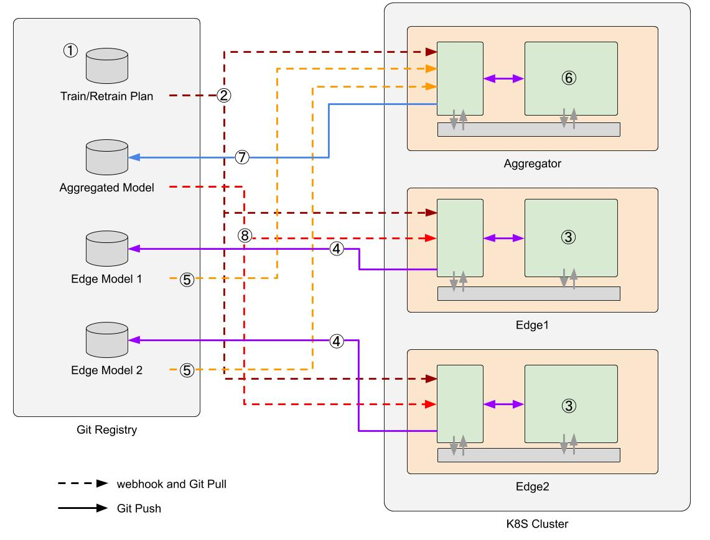
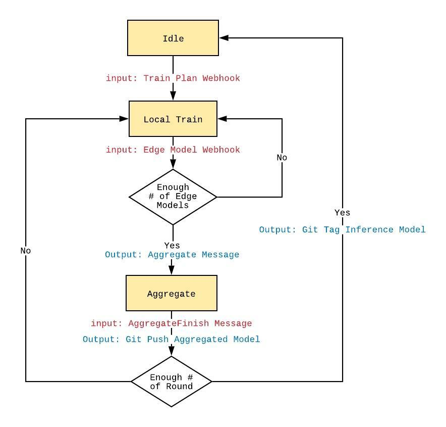
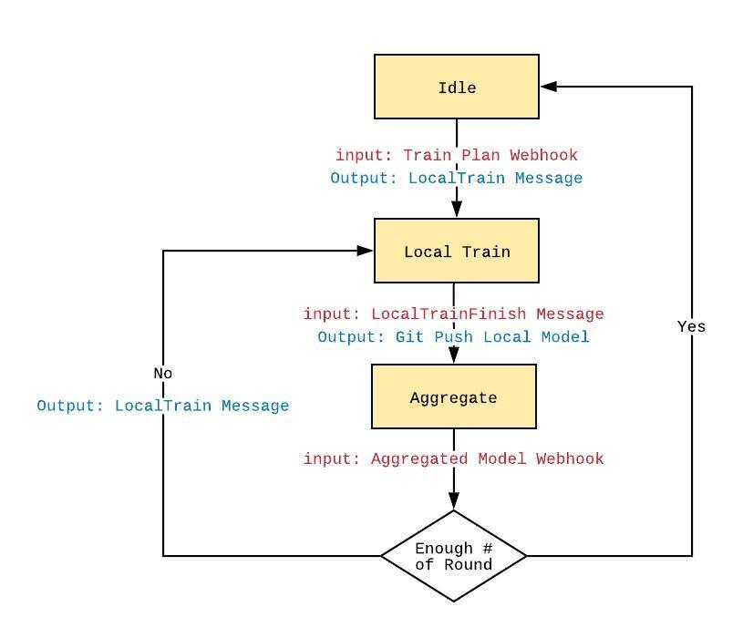

# Harmonia Operator SDK
This README shows usage of `harmonia/operator` image. contents:

- [System Architecture](#system-architecture)
- [System Components](#system-compoments)
    - [Gitea](#giteahttpsgiteaioen-us)
        - [Repositories](#repositories)
    - [Aggregator/Edge Nodes](#aggregatoredge-nodes)
        - [Shared Storage between Operator and Application](#shared-storage)
        - [Operator Container](#operator-container)
            - [Configuration](#configuration)
        - [Application Container](#application-container)
- [FL System States & gRPC protocols](#fl-system-states-grpc--protocols)
    - [Aggregator](#aggregator)
    - [Edge](#edge)

---

## System Architecture
<div align="center"></div>

The above figure illustrates the Harmonia workflow with two local training nodes. The numbers shown in the figure indicate the steps to finish a federated learning cycle in the release. To start a FL training, a training paremeter set is registered in the train plan repository (1), and the registry notifies all the participants via webhooks (2). Two model training nodes are then triggered to load a pretrained global model (3), and start local training with a predefined number of epochs (4). When a local train is completed, the resulting model (called a local model) is pushed to the edge model repository (5) and the aggregator pulls this local model (6). Once the aggregator receives local models of all the participants, it performs model aggregation (7) and push the aggregated model the aggregated model repository (8). The aggregated model is then pulled to local nodes to start another round of local training (9). These processes are repeated until a user-defined converge condition is met.

---

## System Compoments
### [Gitea](https://gitea.io/en-us/)
Gitea is an open source git registry. In Harmonia, it is used to be a public storage and communication channel.

#### Repositories
We have three types of repositories in Gitea:
1. Training Plan: it stores the required parameters for a FL cycle. The training plan should be a json file named `plan.json` :
    ```json
    {
        "name": "A Sample Train Task",
        "pretrainedModel": "<git ref>",
        "round": 100,
        "edge": 2,
        "EpR": 1,
        "timeout": 86400,
    }
    ```
    |Field      |Description                                |
    |---        |---                                        |
    |name       | task name                                 |
    |round      | number of rounds in this FL training job  |
    |edge       | number of edges                           |
    |EpR        | number of epochs per round                |
    |timeout    | local train timeout (second)              |
    |pretrainedModel | git reference to pretrained model commit in the global model repository. |
2. Aggregated Model: it stores aggregated models pushed by the Aggregator container. The final aggregated model is tagged with `inference-<commit_hash_of_train_plan>`.
3. Edge Models: these repositories store local models pushed by each nodes seperatedly.

### Aggregator/Edge Nodes
An FL participant is composed by an `Operator` container and `Application` container.

===

#### Shared Storage
This volume stores git cloned repositories and is shared `Operator` and `Application`.

===

#### Operator Container
Harmonia operator, an instance of `harmonia/operator` image,  is responsible for:
1. handling Gitea webhooks and pulling updates from Gitea.
2. serving `gRPC` requests from an `Application` container 
3. managing FL states, and taking corresponding actions, e.g., pushing models to Gitea or sending messages to an `Application` container.

##### Configuration
`Operator` can be configured with `/app/config.yml`. Each field in the configuration file is described below:
```yaml
type: aggregator
notification:
    type: push
gitUserToken: <aggregator_token>
aggregatorModelRepo:
    gitHttpURL: http://<aggregator_account>@<gitea_URL>/<global_model_repo>.git
edgeModelRepos:
    - gitHttpURL: http://<aggregator_account>@<gitea_URL>/<local_model1_repo>.git
    - gitHttpURL: http://<aggregator_account>@<gitea_URL>/<local_model2_repo>.git
trainPlanRepo:
    gitHttpURL: http://<aggregator_account>@<gitea_URL>/<train_plan_repo>.git
```

|Field      |Description|Required   |
|---        |---        |---        |
|type| one of `aggregator` or `edge`|Required|
|logLevel| one of `debug`, `info`, `warn`, `error`, `panic`, `fatal`|Optional: default `info`|
|logPath| absolute path to log |Optional: default `""`, console log only|
|notification| `NotificationDesp` |Required|
|operatorGrpcServerURI| listens application gRPC message on `hostname:port` |Optional: default `localhost:8787`|
|appGrpcServerURI| location that application gRPC server listens to.  |Optional: default `localhost:7878`|
|gitUserToken| the token of Gitea user |Required|
|aggregatorModelRepo| A `RepositoryDesp` of aggregated model repository |Required|
|trainPlanRepo| A `RepositoryDesp` of train plan repository |Required|
|edgeModelRepos| An `RepositoryDesp` array of edge model repositories \\ |Required by aggregator operator|
|edgeModelRepo.gitHttpURL| A `RepositoryDesp` edge model repository  |Required by edge operator|

|Type       |Description|
|---        |---        |
|RepositoryDesp|An repository medata contains `gitHttpURL`|
|gitHttpURL|format: `http://<username>@<gitea_URL>/<repo>.git`|
|NotificationDesp|push or pull notification metadata|
|NotificationDesp.type|`"push"` or `"pull"`|
|NotificationDesp.stewardServerURI| listens gitea webhooks on `hostname:port` |Optional: default `0.0.0.0:9080`|
|NotificationDesp.pullPeriod| Period between pull (in seconds)  |Optional: default `10`|

===

#### Application Container
Local training or aggregation applications is encapsulated in an `Application` container, which is implemented by users. An `Application` container is responsible for

1. serving `gRPC` requests from operator 
1. performing local model training or model aggregation 
1. sending back process status to operator through Harmonia operator protocol descrobed below  
​  
Users should build gRPC services via `protos/service.proto` with their prefered language and message handlers should be implemented . See [gRPC tutorial](https://grpc.io/docs/tutorials/).  
Following is a piece of aggregator `Application` for demonstration: (see [mnist example](../../examples/mnist) for full example)
```python
import grpc
import os
import service_pb2
import service_pb2_grpc

class AggregateServerServicer(service_pb2_grpc.AggregateServerAppServicer):
    def Aggregate(self, request, context):
        f = os.fork()
        if pid > 0:
            msg = service_pb2.Msg(message="ok")
            return msg
        else:
            # Training Your Model Here
            channel = grpc.insecure_channel(OPERATOR_URI)
            stub = service_pb2_grpc.AggregateServerOperatorStub(channel)
            msg = service_pb2.Msg(message="finish")

            response = stub.AggregateFinish(msg)

def serve():
    server = grpc.server(futures.ThreadPoolExecutor(max_workers=10))
    service_pb2_grpc.add_AggregateServerAppServicer_to_server(AggregateServerServicer(), server)
    server.add_insecure_port(APPLICATION_URI)
    server.start()
    while True:
        time.sleep(10)

if __name__ == "__main__":
    serve()
```

---

### FL System States & gRPC protocols
#### Aggregator
<div align="center"></div>

gRPC protocol:
* Message to `Application`
    * Aggregate:  
    This message is sent when aggregator `Operator` pulls all local models to the shared volume that means it is ready for model aggregation.  
        **Message Inputs: AggregateParams**
        ```protobuf
        message AggregateParams {
            message LocalModel {
                // relative path of the edge model from shared storage 
                string path = 7;

                // Training dataset size
                int32 datasetSize = 8;

                // Local customized validation results
                map<string, double> metrics = 21;
            }
            repeated LocalModel localModels = 10;

            message AggregatedModel {
                // Aggregated model output path
                string path = 11;
            }
            AggregatedModel aggregatedModel = 12;
        }
        ```
        Following is an example Aggregate input (written in json format):
        ```json
        {
            "localModels": [{
                "path": "repoOwner/edge1-model",
                "datasetSize": 10000,
                "metrics": {
                    "accuracy": 0.87,
                    "loss": 0.15
                }
            }, {
                "path": "repoOwner/edge2-model",
                "datasetSize": 15000,
                "metrics": {
                    "accuracy": 0.88,
                    "loss": 0.13
                }
            }],
            "aggregatedModel": [{
                "path": "repoOwner/global-model"
            }]
        }
        ```
        **Message Outputs: Empty**

* Message from `Application`
    * AggregateFinish:  
    This action is sent after finishing merge and places the `aggregated model` into `aggregatedModel.path` in `Aggregate` message.
        **Message Inputs: AggregateResult**
        ```protobuf
        message AggregateResult {
            // Aggregation error
            enum Error {
                SUCCESS = 0;
                AGGREGATE_CONDITION = 1;
                FAIL = 2;
            }
            Error error = 16; 

            // Local customized validation results after aggregation
            map<string, double> metrics = 19;
        }
        ```
        Following is an example message (written in json format):
        ```json
        {
            "error": SUCCESS,
            "metrics": {
                "accuracy": 0.85,
                "loss": 0.12
            }
        }
        ```
        **Message Outputs: Empty**

#### Edge
<div align="center"></div>

gRPC protocol:
* Message to `Application`
    * **TrainInit**:
        Edges should initialize FL while receiving this message triggered by a train plan.
        **Message Inputs: Empty**
        **Message Outputs: Empty**
    * **LocalTrain**:
        This event is sent when receiving an `aggregated model` indicating another local train is ready to process.  
        **Message Inputs: LocalTrainParams**  
        ```protobuf
        message LocalTrainParams {
            message BaseModel {
                // relative path of the base model from shared storage
                string path = 1;

                // User customized model metadata which are string to string key value pairs 
                map<string, string> metadata = 2;

                 // Local customized validation results
                map<string, double> metrics = 20;
            }
            BaseModel baseModel = 3;

            message LocalModel {
                // relative path of resulting model from shared storage
                string path = 4;
            }
            LocalModel localModel = 5;

            // Epoch Per Round
            int32 EpR = 6;
        }
        ```
        Following is an example message (written in json format):
        ```json
        {
            "baseModel": {
                "path": "repoOwner/global-model",
                "metrics": {
                    "accuracy": 0.85,
                    "loss": 0.12
                }
            },
            "localModel": {
                "path": "repoOwner/local-model1",
            },
            "EpR": 1,
        }
        ```
        **Message Outputs: Empty**
    * **TrainInterrupt**:
        An edge should stop and cleanup current local train due to timeout. After response this message, another `LocalTrain` message would be sent to the edge successively.
        **Message Inputs: Empty**
        **Message Outputs: Empty**
    * **TrainFinish**:
        A FL was finished at receiving this message. Edge should cleanup and gracefully stop the service
        **Message Inputs: Empty**
        **Message Outputs: Empty**

* Message from `Application`
    * **LocalTrainFinish**:
    This action is sent without payload after user finishes local train.
        **Message Inputs: LocalTrainResult**
        ```protobuf
        message LocalTrainResult {
            // Local train error
            enum Error {
                SUCCESS = 0;
                FAIL = 1;
            }
            Error error = 13;

            // Training dataset size
            int32 datasetSize = 14;

            // User customized model metadata which are string to string key value pairs
            map<string, string> metadata = 15;

            // Local customized validation results
            map<string, double> metrics = 18;
        }
        ```
        Following is an example message (written in json format):
        ```json
        {
            "error": SUCCESS,
            "datasetSize": 10000,
            "metrics": {
                "accuracy": 0.89,
                "loss": 0.1
            }
        }
        ```
        **Message Outputs: Empty**
    * **TrainFinish**:
        A FL was finished at receiving this message. Edge should cleanup and gracefully stop the service
        **Message Inputs: Empty**
        **Message Outputs: Empty**
